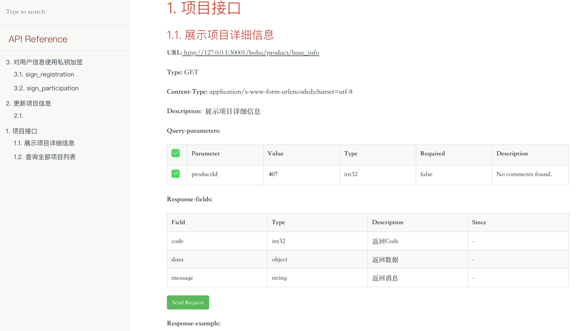

# 后端服务构建部署说明
## 0. 前置条件

需要确保在开发环境中安装好 jdk8, maven(3.6.3+) && docker(20.10.17+) 和 docker compose(高版本docker安装时自带,低版本需要自行安装)

## 1. 数据库

    MySQL 5.7.29

    存储引擎：INNODB
    字符集编码：utf8mb4


| 数据库名    | 用户名  | 密码   |
|---------|------| ------ |
| brewery | root | 123456 |


应用列表：

| 服务名           | 开放端口 |
|---------------|------|
| portal-api    | 8080 |
| MySQL（5.7.29） | 3306 |


## 2.本地构建 && 镜像打包：

### 2.1 构建 portal-api 服务镜像
    
    cd c2n-be

    # 打包后端服务
    mvn clean install -Dmaven.test.skip=true

    # 构建容器镜像
    cd portal-api
    ./docker-build.sh

### 2.2 生成接口文档

    cd c2n-be

    mvn -Dfile.encoding=UTF-8 smart-doc:html

    在 portal-api/docs/html 目录下生成 debug-all.html 文件，使用浏览器打开查看接口文档。
    
    在portal-api/docs/html-example目录下保存了一份示例，供前端调用。
    

文档示例：




### 2.3 配置修改

#### 2.3.1 新建配置文件    

    cd deployment/docker-env
    
    #复制
    cp portal-api.env.example portal-api.env

#### 2.3.2 修改配置文件 portal-api.env

配置样例如下:
```shell
SPRING_PROFILES_ACTIVE=dev
TZ=Asia/Shanghai

# 私钥
OWNER_PRIVATE_KEY=privatekey

# mysql 数据库配置
DB_HOST=brewery-mysql:3306
DB_NAME=brewery
DB_USERNAME=root
DB_PWD=123456

```

以上配置中，
OWNER_PRIVATE_KEY 的值需改为私钥内容。
私钥格式：OWNER_PRIVATE_KEY=702b0c8d127e662aff3fbdba0e797b6598f50cc8712230be8791963412345678
DB_XXX 配置为数据库配置，无需修改，如果使用外部数据库可以自行改为对应配置内容。


### 2.4 启动服务

    docker compose up -d 
    或者
    docker-compose up -d  # 使用低版本docker时，单独安装的 docker-compose 时使用

    # 查看服务启动日志
    docker-compose logs -f

    
### 2.5 新增项目数据记录

#### 2.5.1 使用脚本生成sql

    cd c2n-be/utils
    sh generate_update_sql.sh [id] [项目数据json字符串]
    命令样例如下：
    sh generate_update_sql.sh 1 '{"saleAddress": "0x854D2A5697857E1c7d085ae3649bFC5d02F9a483", "saleToken": "0x8332c63860eBAf9eCb1e61fb1829C76D2B2A1cB7", "saleOwner": "0x0f590970a45d0b4c2dcfcaFF453400eE9B91B317", "tokenPriceInEth": "100000000000", "totalTokens": "10000000000000000000000", "saleEndTime": 1715244920, "tokensUnlockTime": 1715244729, "registrationStart": 1715243300, "registrationEnd": 1715243600, "saleStartTime": 1715243720 }'

#### 2.5.2 生成如下sql

    delete from product_contract where id = 1;
    INSERT INTO product_contract (`id`,`name`,`description`,`img`,`twitter_name`,`status`,`amount`, `sale_contract_address`, `token_address`,`payment_token`,`follower`,`tge`, `project_website`,`about_html`,`registration_time_starts`,`registration_time_ends`,`sale_start`,`sale_end`,`max_participation`, `token_price_in_PT`,`total_tokens_sold`,`amount_of_tokens_to_sell`,`total_raised`,`symbol`,`decimals`,`unlock_time`,`medias`, `number_of_registrants`,`vesting`,`tricker`,`token_name`,`roi`,`vesting_portions_unlock_time`,`vesting_percent_per_portion`, `create_time`,`update_time`,`type`,`card_link`,`tweet_id`,`chain_id`,`payment_token_decimals`,`current_price`) VALUES (1,'pcontract_1','pcontract_1 desc','/img/pc_1.jpg','david_1',0,'10000000000000000000000', '0x854D2A5697857E1c7d085ae3649bFC5d02F9a483', '0x8332c63860eBAf9eCb1e61fb1829C76D2B2A1cB7','200',0,'2024-05-09 16:52:09', 'http://404.com','http://404.com/about.html','2024-05-09 16:28:20','2024-05-09 16:33:20','2024-05-09 16:35:20','2024-05-09 16:55:20','10', '100000000000','1','30','111','MCK',18,'2024-05-09 16:52:09',null, 1,null,null,'DemoToken1','1',null,null, '2024-04-25T12:25:07','2024-05-06T12:27:31',0,'http://card_link_1.com','tweet_id_1',11155111,18,0);

#### 2.5.3  进入 mysql 容器，连接 mysql 服务，并插入数据

    docker exec -it brewery-mysql  /bin/bash
    mysql -uroot -p123456 brewery
    执行步骤 2.5.2 部分生成的sql语句，插入数据即可

